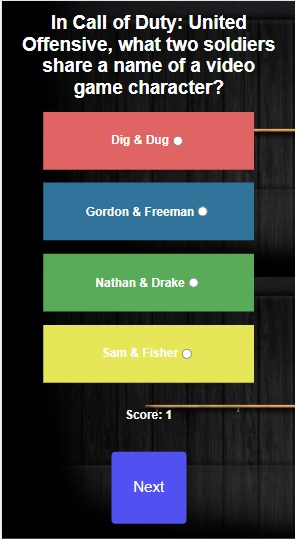

# QUIZ
My Quiz is a project created for "The Bridge" bootcamp, and it contains random questions about several things. My quiz also saves your scores and displays a graphic showing the record.

## TECHNOLOGIES 🛠️
This quiz was created using HTML, CSS, Javascript, the chartist library(graphics), and the local storage. The code was written in Visual Studio Code.

### REQUIREMENTS 📋
You only need an internet navigator to run the page.

### HOW TO PLAY 🔧
Ones in the page(accesed by link) just click on "Start Quiz" and the Quiz will iniciate. Select and opcion and click on "Next". There are 5 questions and the final page will show you your final score and a graphic. To take the quiz one more time just press "Start Over". You will see your record in a graphic located in the first page.

### Preview
#### For desktop: 

First screen:

 

Random question: 

 

Final screen:

 

#### For mobile phones:

First screen:

 

Random question: 

 

Final screen:

 

## Author ✒️
* **Ivan Puebla** - *The Bridge* - [ivanpuebla10](https://github.com/ivanpuebla10)

